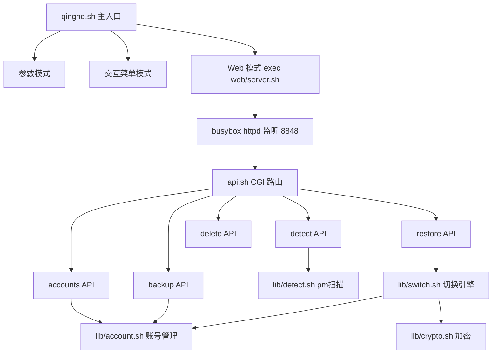
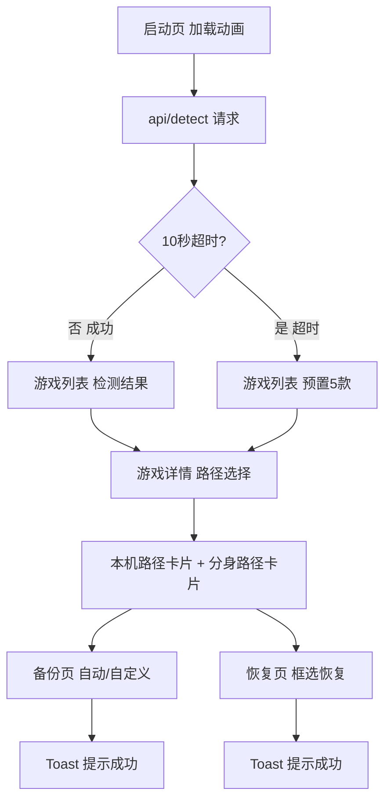

# 清荷 v3 - HelloKitty 主题 Web UI 改造

Feature Name: qinghe-hellokitty-ui
Updated: 2026-07-27

## 描述

全新实现腾讯手游账号本地切换器"清荷"。提供 KSU/Magisk 模块和 MT 管理器 Shell 脚本两种形态。Web UI 采用 HelloKitty 粉色主题，支持自动检测/超时回退、本机/分身路径选择、自动/手动双模式备份、框选式恢复。

## 全新项目结构

```
qinghe/
├── qinghe.sh                    # 主入口脚本 (MT 管理器可直接执行)
├── lib/
│   ├── common.sh                # 公共函数 (日志、环境检测、依赖检查)
│   ├── games.sh                 # 游戏配置解析 (5款游戏)
│   ├── detect.sh                # 游戏检测 (pm + 分身路径扫描)
│   ├── account.sh               # 账号管理 (备份/列表/删除)
│   ├── switch.sh                # 切换引擎 (备份→应用→修复权限→回滚)
│   └── crypto.sh                # 加密模块 (openssl aes-256-cbc)
├── web/
│   ├── server.sh                # Web 服务启动 (busybox httpd + CGI)
│   ├── api.sh                   # CGI API 路由 (detect/accounts/backup/restore/delete/status)
│   └── index.html               # Web UI (HelloKitty 主题 SPA)
├── module/                      # KSU/Magisk 模块目录
│   ├── module.prop              # 模块元数据
│   ├── customize.sh             # 安装脚本
│   ├── uninstall.sh             # 卸载脚本 (询问保留数据)
│   ├── service.sh               # 开机服务 (预留)
│   └── webroot/                 # 模块内置 Web UI 静态资源
│       └── index.html           # (与 web/index.html 同步)
├── package.sh                   # 打包脚本 (生成模块 zip + 脚本发布包)
└── README.md                    # 项目说明
```

## 架构

### 运行时架构



### Web UI 页面流



## 组件设计

### 核心库 `lib/common.sh`

| 函数 | 职责 |
|------|------|
| `log_info(msg)` | 输出 [INFO] 绿色日志 |
| `log_warn(msg)` | 输出 [WARN] 黄色日志 |
| `log_err(msg)` | 输出 [ERR] 红色日志到 stderr |
| `log_ok(msg)` | 输出 [OK] 绿色成功日志 |
| `check_root()` | 检测 root 权限，无则输出错误退出 |
| `detect_env()` | 检测运行环境 (MT/Termux/ADB/模块) |
| `ensure_data_dirs()` | 初始化数据目录结构 |
| `get_data_dir()` | 返回数据存储根目录 |
| `check_cmd(cmd)` | 检查命令是否可用 |

### 游戏配置 `lib/games.sh`

不依赖外部 INI 文件，游戏配置直接硬编码在脚本中。

```sh
# 游戏定义: 简名 显示名 包名 数据路径
GAMES_DB="
sgame|王者荣耀|com.tencent.tmgp.sgame|/data/data/com.tencent.tmgp.sgame
pubgm|和平精英|com.tencent.tmgp.pubgmhd|/data/data/com.tencent.tmgp.pubgmhd
dfm|三角洲行动|com.tencent.tmgp.dfm|/data/data/com.tencent.tmgp.dfm
valorant|无畏契约|com.tencent.tmgp.valorant|/data/data/com.tencent.tmgp.valorant
cf|CF手游|com.tencent.tmgp.cf|/data/data/com.tencent.tmgp.cf
"
```

| 函数 | 职责 |
|------|------|
| `get_game_info(name)` | 返回 name\|display\|pkg\|path |
| `get_display_name(name)` | 返回中文显示名 |
| `get_pkg_name(name)` | 返回包名 |
| `get_data_path(name)` | 返回数据路径 |
| `list_all_games()` | 列出全部 5 款游戏 |

### 游戏检测 `lib/detect.sh`

| 函数 | 职责 |
|------|------|
| `detect_installed_games()` | 通过 `pm list packages` 扫描已装游戏，返回 JSON 数组 |
| `detect_clone_path(pkg)` | 扫描 `/data/user/*/pkg` 检测分身路径 |
| `get_dir_size(path)` | 获取目录磁盘占用大小 |
| `detect_game_json(name)` | 返回单个游戏的完整检测 JSON |

**detect API 返回格式：**

```json
{
  "games": [
    {
      "name": "sgame",
      "display": "王者荣耀",
      "pkg": "com.tencent.tmgp.sgame",
      "installed": true,
      "size": "2.3G",
      "path": "/data/data/com.tencent.tmgp.sgame",
      "clone": {
        "installed": true,
        "path": "/data/user/10/com.tencent.tmgp.sgame",
        "size": "1.8G"
      }
    }
  ]
}
```

### 账号管理 `lib/account.sh`

| 函数 | 职责 |
|------|------|
| `account_backup(game, alias, path, mode)` | 备份数据到存档目录，写 meta.json，mode=auto\|custom |
| `account_list(game, path)` | 列出指定游戏+路径下的备份，JSON 数组 |
| `account_info(alias)` | 查看单个备份详情 |
| `account_delete(alias, auto_confirm)` | 删除备份 |
| `generate_auto_alias()` | 生成自动备份名称 `自动备份-YYYYMMDD-HHmmss` |

**备份目录结构：**

```
{DATA_DIR}/accounts/<游戏简名>/<路径hash>/
├── <别名>/
│   ├── meta.json
│   └── data/
│       ├── shared_prefs/
│       ├── databases/
│       └── files/
```

**meta.json 格式：**

```json
{
  "alias": "自动备份-20260727-143052",
  "game": "sgame",
  "display": "王者荣耀",
  "path": "/data/data/com.tencent.tmgp.sgame",
  "is_clone": false,
  "mode": "auto",
  "created_at": "2026-07-27 14:30:52",
  "data_size": "2.3G"
}
```

### 切换引擎 `lib/switch.sh`

| 函数 | 职责 |
|------|------|
| `check_game_running(pkg)` | 检测游戏进程，运行中返回真 |
| `backup_current_snapshot(game, path)` | 切换前自动备份当前数据为快照 |
| `apply_backup(alias)` | 从存档恢复数据到游戏目录 |
| `fix_permissions(path, pkg)` | 修复目录 owner/group 和 SELinux context |
| `switch_account(alias)` | 一键切换主流程 |
| `rollback(game, path)` | 回滚到上一个快照 |

**切换流程：**
```
1. check_game_running → 运行中则中断并提示
2. backup_current_snapshot → 自动备份当前为快照
3. apply_backup → 覆盖目标备份数据到游戏目录
4. fix_permissions → 修复权限和 SELinux
5. 输出成功 / 失败则 rollback
```

### 加密 `lib/crypto.sh`

| 函数 | 职责 |
|------|------|
| `encrypt_file(input, output, pass)` | openssl aes-256-cbc 加密 |
| `decrypt_file(input, output, pass)` | openssl 解密 |
| `tar_encrypt(dir, output, pass)` | tar.gz 后加密 |
| `tar_decrypt(input, dir, pass)` | 解密后解包 |

### Web 服务 `web/server.sh`

- 通过 busybox httpd 在端口 8848 启动 CGI 服务
- 将 `api.sh` 映射为 `/cgi-bin/api` CGI 脚本
- 将 `index.html` 作为根路径静态资源
- 记录启动 PID，用于后续关闭
- Web 超时机制：120 秒无请求自动退出

### Web API `web/api.sh`

| 端点 | 方法 | 参数 | 说明 |
|------|------|------|------|
| `detect` | GET/POST | (无) | 扫描已装游戏，返回含分身信息 JSON |
| `accounts` | POST | `game`, `path` | 列出指定游戏+路径下备份列表 |
| `backup` | POST | `game`, `alias`, `path`, `mode` | 备份操作，mode=auto\|custom |
| `restore` | POST | `alias` | 恢复操作 (含自动备份+权限修复) |
| `delete` | POST | `alias` | 删除备份 |
| `status` | GET | (无) | 返回版本、数据目录、SELinux 状态 |

### Web UI `web/index.html`

单文件 SPA，内嵌 CSS/JS，无外部依赖。

**5 个逻辑页面（通过 JS 切换显示）：**

1. **启动页** (`#page-loading`) - 蝴蝶结动画 + 10秒倒计时
2. **游戏列表** (`#page-games`) - 自动检测结果或预置列表
3. **路径选择** (`#page-paths`) - 并排卡片：本机 / 分身
4. **备份页** (`#page-backup`) - 自动备份按钮 / 自定义备份 Modal
5. **恢复页** (`#page-restore`) - 备份卡片列表 + 复选框 + 确认弹窗

**UI 设计规范：**

- 主色 `#FF6B9D`，辅色 `#FF85AB`，淡粉 `#FFB8CC`
- 背景渐变 `#FFF0F5` → `#FFD6E0`
- 卡片 `border-radius: 14px`, `box-shadow: 0 2px 12px rgba(255,107,157,0.15)`
- 字体 `PingFang SC / Microsoft YaHei / sans-serif`
- 按钮使用 `linear-gradient` 粉色渐变
- 选中状态：粉色边框 `2px solid #FF6B9D` + 浅粉背景 `#FFF0F5`
- 交互反馈：`transform: scale(0.98)` 按压效果
- HelloKitty 元素：蝴蝶结 🎀 装饰、粉色爱心 ♥ 点缀、圆润猫耳形装饰

## 数据目录

| 环境 | 数据目录 | 说明 |
|------|---------|------|
| KSU/Magisk 模块 | `/data/qinghe/` | 模块安装后固定路径 |
| MT 管理器 / Shell 独立 | `脚本同级目录/qinghe-data/` | 随脚本移动 |

目录结构：

```
{DATA_DIR}/
├── accounts/          # 账号备份存档
│   └── <游戏名>/
│       └── <路径hash>/
│           └── <别名>/
│               ├── meta.json
│               └── data/
└── snapshots/         # 切换前自动快照
    └── <游戏名>/
        └── snapshot_YYYYMMDDHHmmss/
```

## 正确性属性

- 切换前必须完成自动备份，备份失败则中断切换
- SELinux context 修复 (restorecon -R) 必须在数据覆盖后立即执行
- 分身路径检测必须通过 `ls /data/user/*/<pkg>` 实际文件存在检测
- 超时计时器必须使用 `setTimeout`，不能依赖 Promise 超时
- Web 服务关闭时必须 kill 子进程，不留孤儿进程

## 错误处理

| 场景 | 处理 |
|------|------|
| 无 root 权限 | 报错退出，提示需要 root |
| 游戏进程运行中 | 弹窗警告，拒绝恢复/切换 |
| 存储空间不足 | 备份前 `df` 检查，不足则拒绝并提示 |
| API 请求失败 | Toast 红色错误提示，保留页面状态 |
| 备份数据损坏 | 校验 meta.json 存在且字段完整 |
| SELinux Enforcing | 尝试 restorecon，失败则提示手动 setenforce 0 |
| 分身路径不存在 | 仅显示本机路径卡片，不报错 |

## 测试策略

- 在 Android 设备 (Magisk/KSU) 上验证完整流程
- 在 Termux 模拟环境中测试 Shell 脚本逻辑
- 模拟 10 秒超时：临时移除 pm 命令或延迟 API 响应
- 交叉验证：Android 10/11/12/13/14
- 模块安装/卸载测试：Magisk Manager 和 KSU WebUI
